# Background

This repository contains a sample node.js application to demonstrate how to build and configure multiple Lookup Adapters on Gladly with Actions. It also demonstrates how to validate the Gladly Signature sent over via each lookup request.

This repository should be used as a tool for **learning** and not as production code!

In particular, this repository houses 2 Lookup Adapters:
- **Loyalty**: Shows loyalty information and Actions on Customer profile in Gladly
- **Orders**: Shows order history and order Actions on Customer profile in Gladly

## Further Reading on Lookup Adapters
Lookup Adapters allow developers to display real-time data about a Customer on the Customer profile in Gladly. More information on Lookup Adapters can be found [here](https://developer.gladly.com/tutorials/lookup).

Did you know you could also build more than one Lookup Adapter to connect with Gladly? Further reading on configuring Lookup Adapters can be found [here](https://help.gladly.com/docs/set-up-and-edit-custom-integration).

## Further Reading on Actions
Actions allow developers to build Agent interactions directly in Gladly. For example, Agents can cancel an order, edit an order, award loyalty points and more. More on Actions can be found [here](https://help.gladly.com/docs/set-up-and-edit-custom-integration).

# About this application

## What does the Loyalty Lookup Adapter do?
This Lookup Adapter displays loyalty points information and transactions on a linked Customer profile in Gladly. Loyalty points data is stored in the `sample-data/users-loyalty-sample.csv` and `sample-data/transactions-loyalty-sample.csv` files of this repository.

In particular, this Lookup Adapter has the following features:
- Conducts Basic Suggestion lookup on an unlinked Customer profile in Gladly, attempting to match by the Customer profile's **first** email address. This request is made every time an unlinked Customer profile is loaded in Gladly.
- Allows Agents to do a Basic Search to lookup matching records using an email address

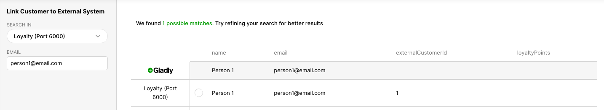

- When a Customer profile is linked in Gladly, conducts Detailed Lookup to display loyalty points, and loyalty rewards (using the `ORDER` card template) for that Customer

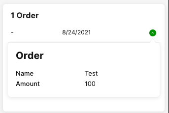

- When a Customer profile is linked in Gladly, displays an Action called `A Sample Action on Customer`, available in the `+` menu, allowing Agents to perform a sample Action:

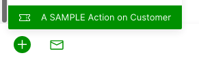

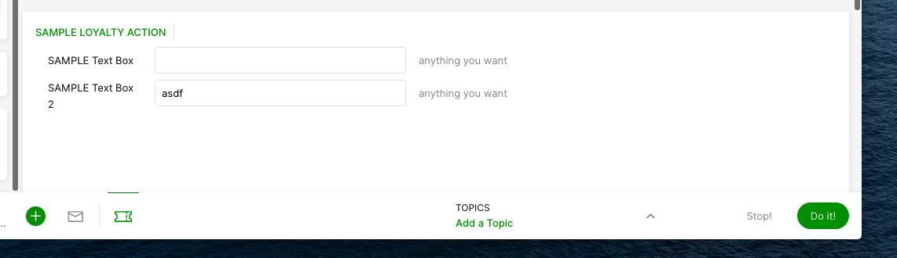

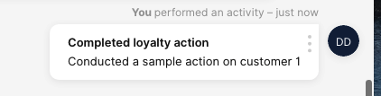

## What does the Orders Lookup Adapter do?
This Lookup Adapter displays order history information on a linked Customer profile in Gladly. Order history data is stored in the `sample-data/users-orders-sample.csv` and `sample-data/transactions-orders-sample.csv` files of this repository.

In particular, this Lookup Adapter has the following features:
- Conducts Basic Suggestion lookup on an unlinked Customer profile in Gladly, attempting to match by the Customer profile's **first** email address. This request is made every time an unlinked Customer profile is loaded in Gladly.
- Allows Agents to do a Basic Search to lookup matching records using an email address

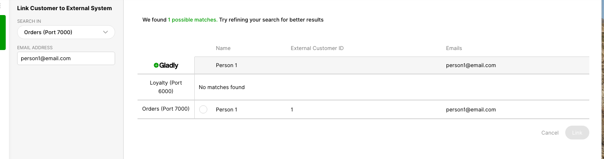

- When a Customer profile is linked in Gladly, conducts Detailed Lookup to display historical order information for that Customer using the `ORDER` card template

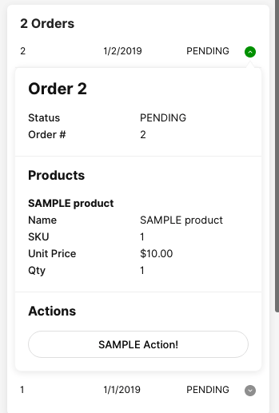

- When a Customer profile is linked in Gladly, displays an Action called `SAMPLE Action!` for each order, allowing Agents to perform an Action on a particular order:

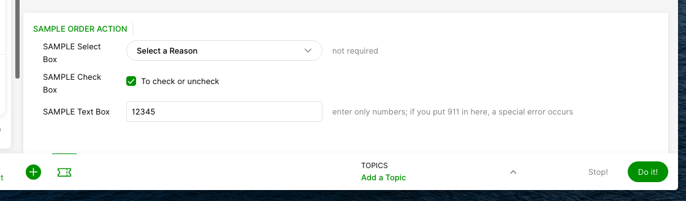

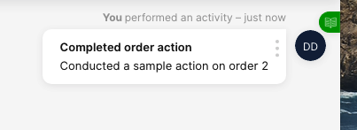

## What are these CSV files in the sample-data folder?
The CSV files are used as a fake database through which the application can lookup fake customer data. In the real world, these would be connected to your database, or external APIs instead of a CSV file in-app.

# Setup

## Before you start
Before you begin, please note the following:
- **This is for local use only. Do not deploy this application to the real-world.**
- Never commit passwords or any other sensitive information to this repository
- This code does NOT validate GET params in requests when calculating signatures (code located in helpers/index.js)

## Developer setup

### node and yarn
This repository uses node.js and yarn in this repository to run our code
- Open up your developer console (e.g.: `Terminal` on Mac OSX)
- Install [Homebrew](https://brew.sh/)
- Install [node](https://nodejs.org/tr/download/package-manager/) using Homebrew
- Install [yarn](https://formulae.brew.sh/formula/yarn)

### localtunnel
To make the Lookup Adapter endpoints accessible from Gladly, the instructions below use [localtunnel](https://github.com/localtunnel/localtunnel) to expose your localhost to the internet. You can also use a tool like [ngrok](https://ngrok.com/) if you prefer.

### Setting up lookup-practice application
- Copy the `.env-sample` file into `.env` and update the GLADLY_SIGNING_KEY settings. For the purposes of this demo, the same GLADLY_SIGNING_KEY settings will be used between both lookup adapters
- In Terminal, `cd` to this directory (e.g.: `cd ~/Desktop/ps-lookup-practice`)
- Run `yarn install` in Terminal
- Run `node orders-sample.js` in Terminal
- Open a new tab in Terminal
- Run `node loyalty-sample.js` in Terminal
- Open a new tab in Terminal
- Run `npx localtunnel --port 6000` in Terminal. This will output an https link. Let's call this URL Loyalty
- Open a new tab in Terminal
- Run `npx localtunnel --port 7000` in Terminal. This will output an https link. Let's call this URL Orders

### Viewing request and response logs
All requests and response payloads are logged via `console.log` to your developer console.

Sample logs that you may see in your developer console will look like this:

```
[2022-05-24 09:23:05] Got POST request from Gladly.
-- Path: /
-- Body: {"lookupLevel":"BASIC","query":{"emails":["yasir@gladly.com"],"id":"Br1zuiBMTA-daPVl50x45w","name":"Yasir Sadeque"},"uniqueMatchRequired":false}
-- Headers: {"host":"5d2d-2600-1700-6f80-24b0-7ceb-227d-56f0-6994.ngrok.io","user-agent":"Go-http-client/1.1","content-length":"144","accept":"application/json","accept-encoding":"gzip","authorization":"Basic ZTpl","content-type":"application/json","gladly-authorization":"SigningAlgorithm=hmac-sha256, SignedHeaders=accept;authorization;content-type;gladly-correlation-id;gladly-time;www-authenticate;x-b3-traceid, Signature=763368f56032a74e8eea03d1a0362f70ca9dff5cf10bdbaa1fd16ba70dfd8112","gladly-correlation-id":"XvIZz4Q1R0CZcGbB5pmZig","gladly-time":"20220524T162305Z","www-authenticate":"Basic realm=\"e\"","x-b3-traceid":"5ef219cf84354740997066c1e699998a","x-forwarded-for":"34.227.54.194","x-forwarded-proto":"https"}
```

```
[2021-08-25 17:28:38][BASIC] Sending results {"results":[{"externalCustomerId":"1","emails":[{"original":"person1@email.com"}],"phones":[{"original":"+14151234567","type":"MOBILE"}],"name":"Person 1","customAttributes":{"points":"100"}}]} for loyalty lookup
```

We highly recommend analyzing the logs when utilizing this repository to get familiar with Gladly's request and response formats.

## Gladly Setup

### Loyalty Lookup Adapter
- Login to your Gladly instance as an Admin
- Go to More Settings > Apps
- Click on `Add App`
- In `Name`, enter `Loyalty (Port 6000)`
- In URL, enter the ngrok URL you copied for the Loyalty Lookup Adapter above (e.g.: `https://hello-24-5-25-66.ngrok.io`)

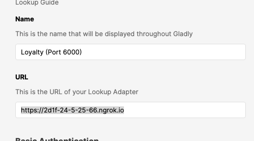

- In `Basic Authentication` (username, password and realm) - enter random values. Our Lookup Adapter ignores Basic Auth (not a good practice in the real-world!)
- In `Request Signature`, enter the signing key value to whatever you set up in GLADLY_SIGNING_KEY in the `.env` file you created.
- In `Customer Linking` add `email` as the attribute and `email` as the label

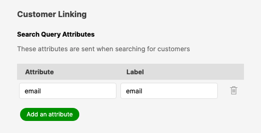

- In Search Results Attributes, enter these values:

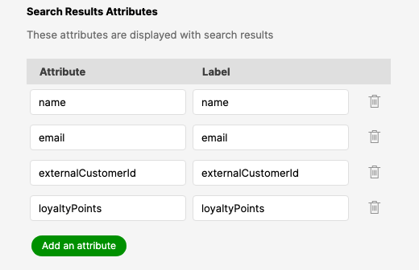

- Skip the sections on `Auto-linking Fields` and `Overwrite Existing Values`. You can learn more about what these settings do [here](https://help.gladly.com/docs/set-up-and-edit-custom-integration)
- In `Actions`, click on `Enable Actions`
- Click on `Save App`

### Orders Lookup Adapter
- Login to your Gladly instance as an Admin
- Go to More Settings > Apps
- Click on `Add App`
- In `Name`, enter `Orders (Port 7000)`
- In URL, enter the ngrok URL you copied for the Orders Lookup Adapter above (e.g.: `https://world-24-5-25-66.ngrok.io`)

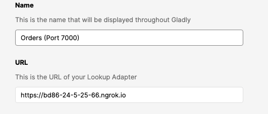

- In `Basic Authentication` (username, password and realm) - enter random values. Our Lookup Adapter ignores Basic Auth (not a good practice in the real-world!)
- In `Request Signature`, enter the signing key value to whatever you set up in GLADLY_SIGNING_KEY in the `.env` file you created.
- In `Customer Linking` add `email` as the attribute and `email` as the label


- In Search Results Attributes, enter these values:

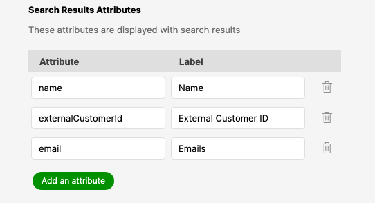

- Skip the sections on `Auto-linking Fields` and `Overwrite Existing Values`. You can learn more about what these settings do [here](https://help.gladly.com/docs/set-up-and-edit-custom-integration)
- In `Actions`, click on `Enable Actions`
- Click on `Save App`

## Testing
- Create a new profile with the email `person1@email.com` in Gladly
- Click on `Link to external customer`

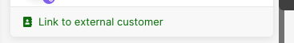

- Do a search for `person1@email.com` across all systems

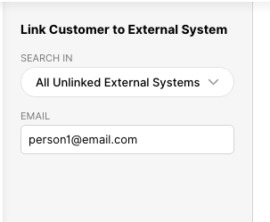

- Result should show one entry for Orders and Loyalty adapters
- Link to both
- Perform some Actions!
